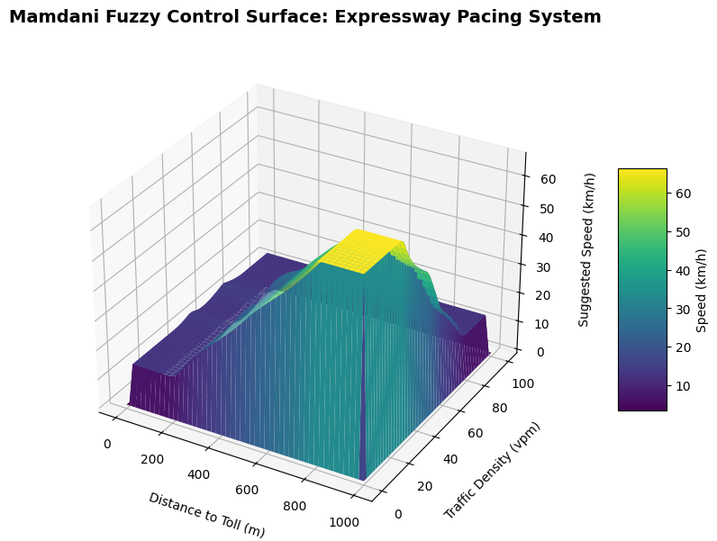

# Expressway Toll Approach Pacing System
**Fuzzy Logic Controller**

This repository contains a C# Windows Forms application that implements a Mamdani Fuzzy Inference System. It is designed to dynamically regulate vehicle speed during the approach to the Cebu-Cordova Link Expressway (CCLEX) toll plaza, utilizing continuous degrees of truth to prevent sudden braking and improve traffic flow.

## 1. System Documentation

### Input Variables
| Variable | Universe of Discourse | Fuzzy Sets (Membership Functions) |
| :--- | :--- | :--- |
| **Distance to Toll** | 0 - 1000 meters | Near (Trapezoidal), Medium (Triangular), Far (Trapezoidal) |
| **Traffic Density** | 0 - 100 vehicles/min | Light (Trapezoidal), Moderate (Triangular), Heavy (Trapezoidal) |

### Output Variable
| Variable | Universe of Discourse | Fuzzy Sets (Membership Functions) |
| :--- | :--- | :--- |
| **Suggested Speed** | 0 - 80 km/h | Slow (Trapezoidal), Coast (Triangular), Cruise (Trapezoidal) |

### Fuzzy Rule Matrix
The system utilizes a 9-rule base evaluated using the **MIN** operator for condition aggregation (AND). 

| Distance \ Traffic | Light | Moderate | Heavy |
| :--- | :--- | :--- | :--- |
| **Near** | Slow | Slow | Slow |
| **Medium**| Coast | Coast | Slow |
| **Far** | Cruise | Coast | Slow |

## 2. Visualizations & Analysis

### Dynamic Membership Plots
The application features a real-time GDI+ rendering engine that plots the clipped membership functions (Slow, Coast, Cruise) and the calculated Center of Gravity (Centroid) during runtime.

### 3D Control Surface
The control surface below illustrates the system dynamics across all possible combinations of Distance and Traffic Density, mapped to the final defuzzified Speed output.

## 3. Technical Implementation
* **Inference Model:** Mamdani
* **Fuzzification:** Crisp inputs to geometric membership degrees
* **Rule Implication:** MIN operator
* **Aggregation:** MAX operator
* **Defuzzification:** Centroid (Center of Gravity)
* **Framework:** C# .NET Windows Forms
